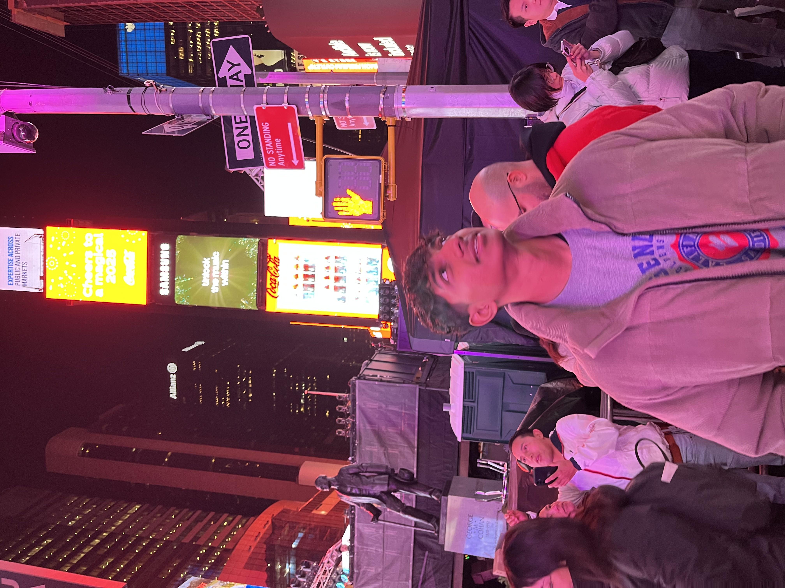

# Yash Datar's Personal Portfolio Website

A modern, responsive personal portfolio website showcasing my work, skills, and personality.



## 🚀 Features

- **Modern Design**: Clean, professional layout with gradient themes
- **Smooth Animations**: Eye-catching CSS animations and transitions
- **Fully Responsive**: Works perfectly on all devices (mobile, tablet, desktop)
- **Interactive Navigation**: Smooth scrolling with active section highlighting
- **Multiple Sections**:
  - Home/Hero section with profile image
  - About Me with skills showcase
  - Professional Resume/Experience
  - Projects Portfolio
  - Hobbies & Interests
  - Contact form with social links
- **Optimized Performance**: Lazy loading, debounced scroll events
- **SEO Friendly**: Proper meta tags and semantic HTML

## 📁 Project Structure

```
Personal-Website/
├── index.html              # Main HTML file
├── css/
│   └── styles.css         # Main stylesheet with animations
├── js/
│   └── main.js           # JavaScript for interactions
├── assets/
│   ├── images/
│   │   └── IMG_0632.jpg  # Profile image
│   └── resume.pdf        # Downloadable resume (add your own)
├── public/               # Old files (can be removed if not needed)
└── README.md            # This file
```

## 🛠️ Technologies Used

### Frontend
- **HTML5**: Semantic markup for better SEO
- **CSS3**: Modern styling with:
  - CSS Grid & Flexbox for layouts
  - CSS Variables for theming
  - Keyframe animations
  - Gradient backgrounds
  - Responsive design with media queries
- **JavaScript (Vanilla)**: No frameworks, pure JS for:
  - Smooth scrolling
  - Mobile menu toggle
  - Scroll-based animations
  - Active navigation highlighting
  - Form handling
  - Intersection Observer API

### Libraries & Resources
- **Font Awesome**: Icons (via CDN)
- **Google Fonts**: Poppins & Playfair Display fonts

### Backend
**Note**: This is a static website and doesn't require a backend. All functionality runs on the client-side. For the contact form to work with an actual email service, you would need to integrate:
- A backend service (Node.js, PHP, etc.)
- Email service (SendGrid, Mailgun, etc.)
- Or use services like Formspree, Netlify Forms, etc.

Currently, the contact form opens your default email client using `mailto:` links.

## 🚀 Getting Started

### Prerequisites
- A modern web browser (Chrome, Firefox, Safari, Edge)
- A text editor (VS Code, Sublime Text, etc.) for customization
- Optional: A local server for testing (Live Server extension, Python SimpleHTTPServer, etc.)

### Installation

1. **Clone or download the repository**
   ```bash
   git clone <your-repo-url>
   cd Personal-Website
   ```

2. **Customize the content**
   - Edit `index.html` to update your personal information
   - Replace `assets/images/IMG_0632.jpg` with your own photo
   - Add your resume PDF to `assets/resume.pdf`
   - Update social media links and contact information

3. **Run the website**
   
   **Option 1: Open directly**
   - Simply double-click `index.html` to open in your browser
   
   **Option 2: Use a local server (recommended)**
   ```bash
   # Using Python 3
   python -m http.server 8000
   
   # Using Python 2
   python -m SimpleHTTPServer 8000
   
   # Using Node.js (if you have http-server installed)
   npx http-server
   ```
   Then open `http://localhost:8000` in your browser

## ✏️ Customization Guide

### 1. Update Personal Information
Edit `index.html` and update:
- Your name and title
- About me description
- Education and experience details
- Project information
- Hobbies and interests
- Contact details and social media links

### 2. Change Colors
Edit `css/styles.css` and modify the CSS variables at the top:
```css
:root {
    --primary-color: #667eea;      /* Main color */
    --primary-alt: #764ba2;        /* Alternative primary */
    --secondary-color: #f093fb;    /* Accent color */
    /* ... more variables ... */
}
```

### 3. Add Your Resume
- Place your resume PDF in `assets/resume.pdf`
- Or update the download link in `index.html`:
  ```html
  <a href="assets/your-resume-name.pdf" class="button" download>
  ```

### 4. Update Profile Image
- Replace `assets/images/IMG_0632.jpg` with your photo
- Keep the same filename, or update the path in `index.html`:
  ```html
  
  ```

### 5. Add More Projects
Copy and paste the project card structure in the Projects section:
```html
<div class="project__card">
    <!-- Your project details -->
</div>
```

## 📱 Responsive Design

The website is fully responsive with breakpoints at:
- **Desktop**: > 992px (full layout)
- **Tablet**: 768px - 992px (adjusted layout)
- **Mobile**: < 768px (mobile menu, stacked layout)

## 🎨 Animations Included

1. **Fade In Effects**: Smooth fade-in for sections
2. **Slide Animations**: Elements slide in from different directions
3. **Hover Effects**: Interactive buttons and cards
4. **Floating Animation**: Profile image floats gently
5. **Typing Effect**: Animated typing for subtitle
6. **Progress Bars**: Animated skill progress bars
7. **Scroll Progress**: Top progress bar showing scroll position

## 🌐 Deployment

### Deploy to GitHub Pages
1. Push your code to GitHub
2. Go to repository Settings > Pages
3. Select main branch as source
4. Your site will be live at `https://yourusername.github.io/repository-name`

### Deploy to Netlify
1. Drag and drop your project folder to [Netlify](https://app.netlify.com/)
2. Or connect your GitHub repository
3. Netlify will automatically deploy your site

### Deploy to Vercel
1. Install Vercel CLI: `npm i -g vercel`
2. Run `vercel` in your project directory
3. Follow the prompts

## 🔧 Browser Support

- Chrome (latest)
- Firefox (latest)
- Safari (latest)
- Edge (latest)
- Opera (latest)

## 📝 Future Enhancements

Potential features to add:
- [ ] Dark mode toggle
- [ ] Blog section
- [ ] Testimonials
- [ ] Backend for contact form
- [ ] Analytics integration
- [ ] Multi-language support
- [ ] More interactive animations
- [ ] Project filtering

## 🤝 Contributing

Feel free to fork this project and customize it for your own use!

## 📄 License

This project is open source and available for personal use.

## 👤 Author

**Yash Datar**

- Website: [Your Website URL]
- GitHub: [@yourusername](https://github.com/yourusername)
- LinkedIn: [Your LinkedIn](https://linkedin.com/in/yourusername)

## 🙏 Acknowledgments

- Font Awesome for icons
- Google Fonts for typography
- Inspiration from various portfolio designs

---

Made with ❤️ by Yash Datar

⭐ Star this repo if you found it helpful!
